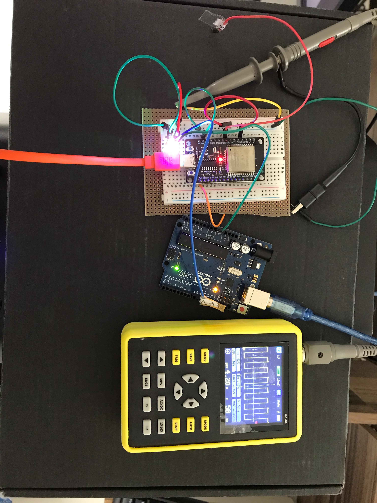
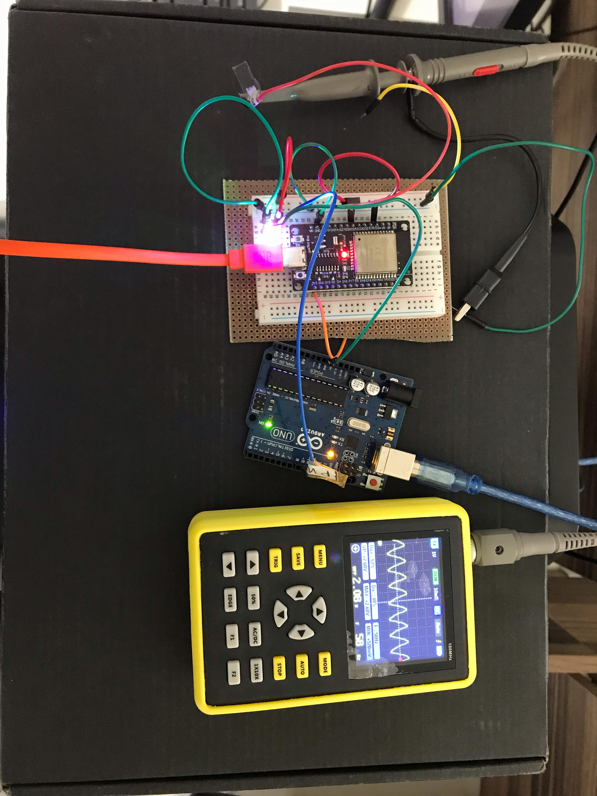

# Processamento Digital de Sinais

Este repositório contém alguns dos projetos desenvolvidos durante a disciplina de **Processamento Digital de Sinais (PDS)**, bem como estudos e pesquisas pessoais relacionados ao tema.

---

## 🎯 Projeto Final

Para o projeto final, foi pensado em empregar um dos conceitos trabalhados ao longo da disciplina em **hardware**. Sendo assim, este projeto implementa um **filtro passa-baixa de Resposta Infinita ao Impulso (IIR)** para filtrar a **primeira componente harmônica** de uma **onda quadrada**.

O hardware escolhido foi um **ESP32**, dado que ele possui conversores **Analógico-Digital (AD)** e **Digital-Analógico (DA)** integrados. Um **Arduino UNO** foi utilizado para gerar uma **onda quadrada de 60 Hz**, como apresentado na imagem abaixo:

  

O ESP32 realiza a **amostragem do sinal** gerado pelo Arduino por meio de seu conversor AD. Em seguida, o sinal é **processado digitalmente** no próprio microcontrolador utilizando um **filtro IIR**. Por fim, o **conversor DA** é utilizado para obter a **primeira componente harmônica** do sinal de entrada, ou seja, uma **onda senoidal de 60 Hz**:

  

## 📺 Assista ao vídeo do sistema em funcionamento:

  
   
  <a href="https://youtu.be/E689NTvVX8Q">https://youtu.be/E689NTvVX8Q</a>

